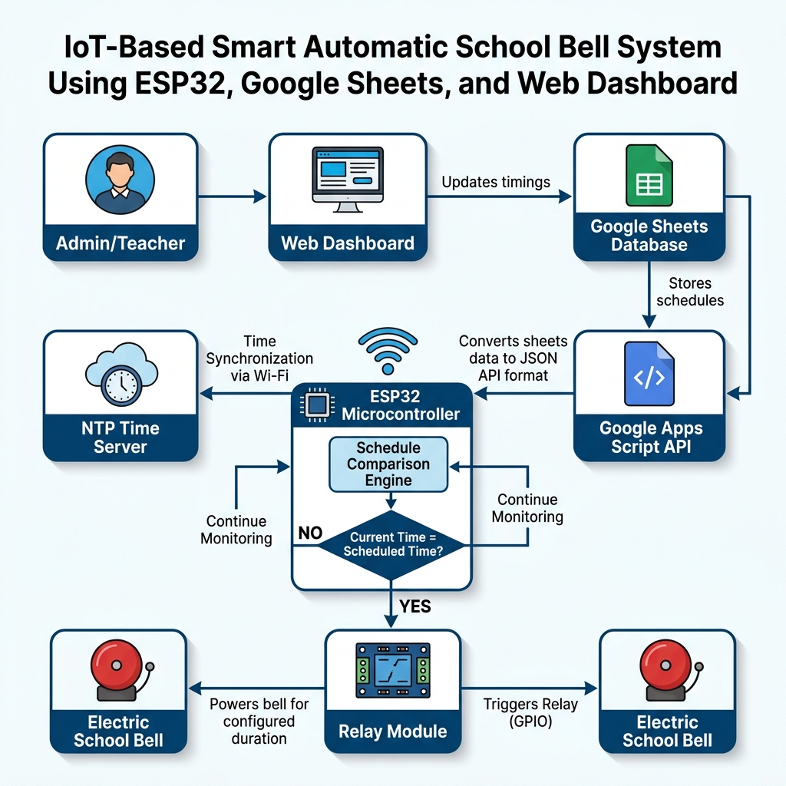

# IoT Automatic School Bell System

This repository contains the design, flowchart, and documentation for a modern, automated, IoT-enabled School Bell System. Designed for college mini-projects and reports, this system integrates an ESP32 microcontroller with cloud databases, NTP/RTC time synchronization, and physical bell relay controls.

---

## 📊 System Flowchart

Below is the flowchart representing the sequence of operations for the automated school bell system.

### Visual Diagram


### Mermaid Diagram
You can copy and render this flowchart using any Markdown viewer or [Mermaid Live Editor](https://mermaid.live).

```mermaid
graph TD
    %% Styling and Theme (Blue and White)
    classDef startEnd fill:#E3F2FD,stroke:#1565C0,stroke-width:2px,rx:20px,ry:20px,color:#0D47A1,font-weight:bold;
    classDef process fill:#FFFFFF,stroke:#1976D2,stroke-width:2px,color:#0D47A1;
    classDef decision fill:#E8F5E9,stroke:#2E7D32,stroke-width:2px,color:#1B5E20,font-weight:bold;

    %% Nodes
    Start([Power ON System]):::startEnd
    ConnectWiFi[Connect ESP32/NodeMCU to Wi-Fi Network]:::process
    SyncTime[Synchronize Time using NTP/RTC Module]:::process
    GetSchedule[Retrieve Bell Schedule from Cloud Database]:::process
    CompareTime[Compare Current Time with Stored Schedule]:::process
    IsBellTime{Is it Bell Time?}:::decision
    ActivateRelay[Activate Relay Module]:::process
    RingBell[School Bell Switches ON & Rings for 10s]:::process
    TurnOffBell[Turn OFF the Bell Automatically]:::process
    UploadLogs[Upload Bell Status & Event Logs to Cloud]:::process

    %% Flow/Connections
    Start --> ConnectWiFi
    ConnectWiFi --> SyncTime
    SyncTime --> GetSchedule
    GetSchedule --> CompareTime
    CompareTime --> IsBellTime
    
    %% Decision paths
    IsBellTime -- No --> CompareTime
    IsBellTime -- Yes --> ActivateRelay
    
    ActivateRelay --> RingBell
    RingBell --> TurnOffBell
    TurnOffBell --> UploadLogs
    UploadLogs --> CompareTime

    %% Formatting links
    linkStyle 5 stroke:#C62828,stroke-width:2px; %% No path
    linkStyle 6 stroke:#2E7D32,stroke-width:2px; %% Yes path
```

---

## 🛠️ System Components

The project consists of the following key hardware and software components:

| Component | Type | Description |
| :--- | :--- | :--- |
| **ESP32 / NodeMCU** | Microcontroller | The central processing unit that connects to Wi-Fi, handles logic, executes time-comparison algorithms, and drives the relay pin. |
| **Wi-Fi Connection** | Network Layer | Establishes internet connectivity to synchronize local time and communicate with the cloud database. |
| **Cloud Database** | Software/Cloud | Stores the daily bell schedule (e.g., firebase, MySQL, or a custom REST API). Allows administrators to modify timings dynamically. |
| **RTC (e.g., DS3231) & NTP** | Time Source | Uses Network Time Protocol (NTP) to get precise time at startup, and a Real-Time Clock (RTC) module to maintain time even during power/Wi-Fi outages. |
| **Relay Module** | Actuator | Optoisolated relay switch that receives low-voltage GPIO signals (3.3V/5V) from the ESP32 to switch high-voltage AC current (110V/220V) for the bell. |
| **School Bell / Buzzer** | Actuator | The physical audible indicator (mechanical bell or electronic buzzer) powered via the relay contacts. |
| **Monitoring Dashboard** | Software/Web | A frontend dashboard (web-page or mobile app) that displays the current bell state, logs historical rings, and offers schedule controls. |

---

## 🔄 Sequence of Operations

1. **Power Initialization:** System powers up and initializes the microcontroller unit (MCU).
2. **Wi-Fi Setup:** MCU tries connecting to the pre-configured SSID. If successful, it proceeds to synchronize time.
3. **Time Sync:** MCU fetches network time via NTP and writes it to the local RTC chip for backup timekeeping.
4. **Fetch Schedule:** MCU connects to the cloud database endpoint and fetches the JSON schedule of school bell timings (e.g., `["08:30", "10:30", "12:00", "13:30", "15:30"]`).
5. **Continuous Time Monitoring:** MCU reads current time from the RTC/NTP loop and checks it against the list of schedule events.
6. **Trigger Logic (Decision):**
   * **Is it Bell Time?**
     * **No:** Loop back to time monitoring.
     * **Yes:** Set relay control pin to `HIGH` to engage the relay.
7. **Buzzer Ringing:** The physical bell rings for a predefined interval (typically `10 seconds`), controlled via a non-blocking `millis()` timer.
8. **Buzzer Shutdown:** Set relay control pin to `LOW` to silence the bell.
9. **Log Transmission:** Send HTTP/MQTT payloads to the Cloud Platform dashboard database to register successful ring event, current battery status, and timestamp.
10. **Loop Reset:** Reset trigger flags and return to continuous monitoring.
